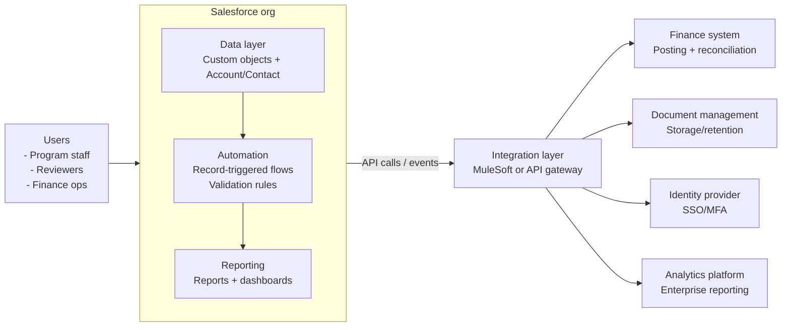
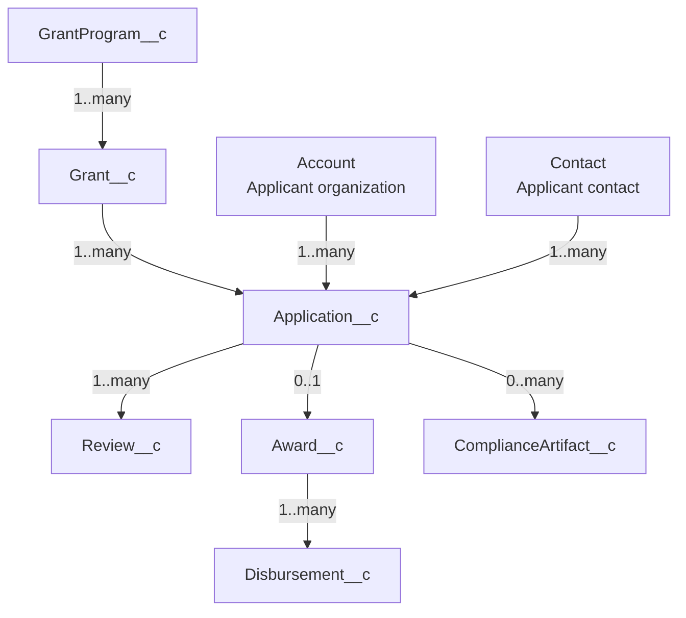
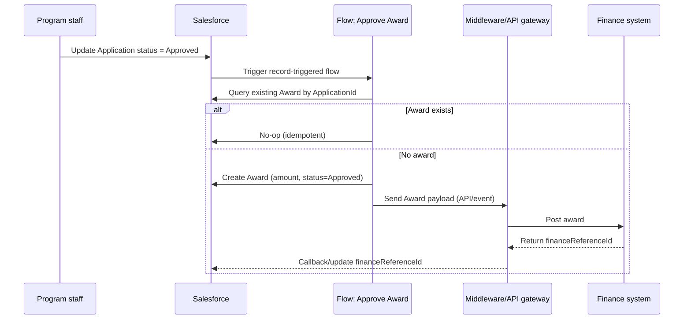

# Architecture overview

## High-level design
This solution models the grants lifecycle in Salesforce with three layers:
1) Experience layer: internal staff console and optional external applicant portal
2) Application layer: objects, flows, and validation rules for lifecycle automation
3) Integration layer: middleware/API gateway for finance, identity, and document management

## Components
- Core data: Grant program, Grant, Application, Review, Award, Disbursement, Compliance artifact
- Operations: Case management for applicant questions (optional add-on)
- Automation: Flows for submit and approve-award, plus validation rules for guardrails
- Reporting: pipeline and funding KPIs

## Non-functional goals
- Security: least privilege access, record sharing, field-level security
- Reliability: idempotent automation patterns, clear error handling model
- Maintainability: prefer Flow where possible, Apex only for complex cases
- Scalability: avoid heavy synchronous processing, use async for heavy workloads

## Data Model

## Sequence Diagram

